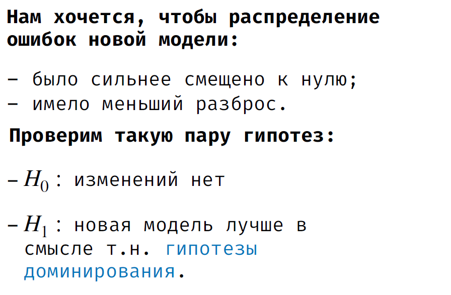
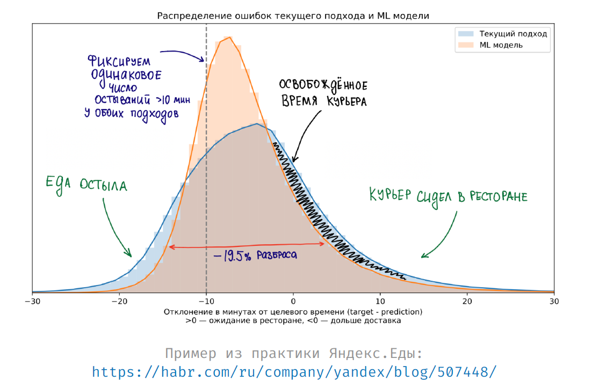
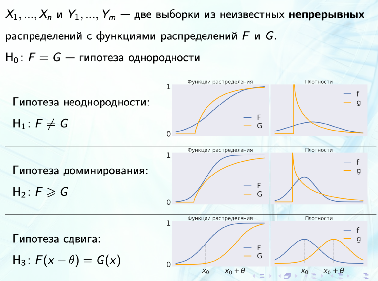
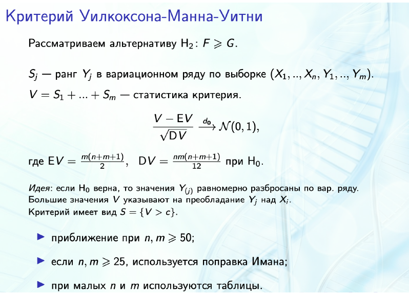
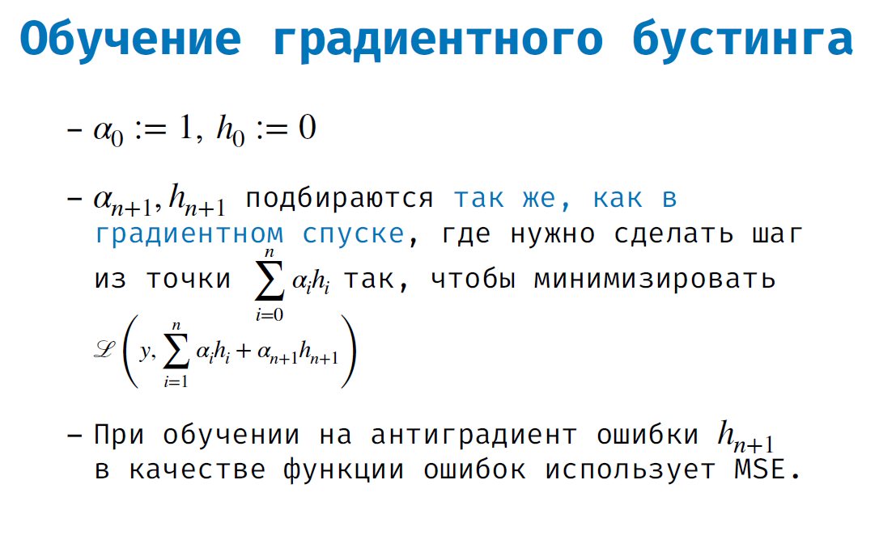

# Школа Data Science от Сбербанка

Данный репозиторий является кратким, структурированным конспектом изучаемого
материала в процессе обучения
в школе Data Science от Сбербанка

## Оглавление

Материалы(презентации, juputer notebooks, etc. в папке materials)

- 0 [Организационное собрание](#Организационное-собрание)
- 1 [Основные инструменты и процесс разработки](#Основные-инструменты-и-процесс-разработки)
- 2 [Написание надёжного поддерживаемого кода на Python](#Написание-надёжного-поддерживаемого-кода-на-Python)
- 3 [Профилирование и оптимизация кода на Python](#Профилирование-и-оптимизация-кода-на-Python)
- 4 [Визуализация данных.](#Визуализация-данных)
- 5 [Математика для ML Часть 1: Методы оптимизации](#Математика-для-ML-Часть-1:-Методы-оптимизации)
- 6 [Математика для ML Часть 2: Вычислительная линейная алгебра](#Математика-для-ML-Часть-2:-Вычислительная-линейная-алгебра)
- 7 [Математика для ML Часть 3: Прикладная теория вероятностей](#Математика-для-ML-Часть-3:-Прикладная-теория-вероятностей)
- 8 [Математика для ML Часть 4: Математическая статистика](#Математика-для-ML-Часть-4:-Математическая-статистика)
- 9 [Основные понятия ML](#Основные-понятия-ML)
- 10_11 [Ансамблевые методы](#Ансамблевые-методы)
- 12 [Введение в Deep Learning](#Введение-в-Deep-Learning)
- 13 [Введение в компьютерное зрение](#Введение-в-компьютерное-зрение)
- 14 [Введение в обработку текстов](#Введение-в-обработку-текстов)

- [other](#other)
- [ссылка на плейлист с лекциями](https://www.youtube.com/playlist?list=PLNxGMRiN2-zX_fNnpFandY8jmCFu6mVYa)

## Организационное собрание

- [00_Organisational.pdf](./materials/0_Организационное_собрание/00_Organisational.pdf)

1. [Leetcode](https://leetcode.com/)
2. [Kaggle](https://www.kaggle.com/kirillionkin)
3. [LinkedIn](https://www.linkedin.com/in/%D0%BA%D0%B8%D1%80%D0%B8%D0%BB%D0%BB-%D0%B8%D0%BE%D0%BD%D0%BA%D0%B8%D0%BD-50a992209/)

## Основные инструменты и процесс разработки

- [01_Developers_Tools.pdf](materials/1_Основные_инструменты_и_процесс_разработки/01_Developers_Tools.pdf)

1. PyCharm([сслыка на скачивание](https://www.jetbrains.com/ru-ru/pycharm/))
    - [линтер Flake8](https://flake8.pycqa.org/en/latest/#)
    - [форматтер Black](https://black.readthedocs.io/en/stable/)
        - [настройка Black в PyCharm(видео)](https://www.youtube.com/watch?v=dxFsjgtyAHw&t=6s&ab_channel=FedericoTartarini)
    - [pre-commit](https://pre-commit.com/)
        - [настройка pre-commit hooks(видео)](https://www.youtube.com/watch?v=Wmw-VGSjSNg&ab_channel=SoftwareEngineerHaydn)

2. Git
    - [Книга Git(обязательна к прочтению)](https://git-scm.com/book/ru/v2)
    - [Онлайн практика с визуализацией работы веток](https://git-school.github.io/visualizing-git/)
    - [Практика GIT(небольшой тренажёр)](https://learngitbranching.js.org/?locale=ru_RU)
    - ["Чёрт побери, GIT!"](https://dangitgit.com/ru)
    - [README.md - markdown syntax](https://github.com/GnuriaN/format-README#%D0%9E%D0%B3%D0%BB%D0%B0%D0%B2%D0%BB%D0%B5%D0%BD%D0%B8%D0%B5)

## Написание надёжного поддерживаемого кода на Python

- [02_Testing_And_Profiling.pdf](./materials/2_Написание_надёжного_поддерживаемого_кода_на_Python/02_Testing_And_Profiling.pdf)
- [02_Testing.ipynb](./materials/2_Написание_надёжного_поддерживаемого_кода_на_Python/02_Testing.ipynb)

1. PyTest([библиотека для тестирования кода](https://docs.pytest.org/en/stable/contents.html))

2. MyPy([type hints - статический анализатор кода](https://mypy.readthedocs.io/en/stable/))
    - [Лекция от JetBrains про type hints в PyCharm](https://www.youtube.com/watch?v=JqBCFfiE11g&ab_channel=JetBrainsTV)
    - [Перевод мастер-класса по MyPy от разработчика Instagram](https://medium.com/@nooovikov/mypy-c03a3174ae7d)
        - [MonkeyType - auto annotations]()

## Профилирование и оптимизация кода на Python

- [03_Profiling_and_optimizing.pdf](./materials/3_Профилирование_и_оптимизация_кода_на_Python/03_Profiling_and_optimizing.pdf)
- [3_Profiling.ipynb](./materials/3_Профилирование_и_оптимизация_кода_на_Python/3_Profiling.ipynb)
- [3_Optimisation_(solved).ipynb](./materials/3_Профилирование_и_оптимизация_кода_на_Python/3_Optimisation_(solved).ipynb)

1. Профилирование - поиск "узких" мест в коде(в Python реализован динамический анализ производительности кода).
    - встроенные средства профилирования в PyCharm:
        - [ссылка](https://www.jetbrains.com/help/pycharm/profiler.html)
        - [ссылка](https://www.jetbrains.com/help/pycharm/v8-cpu-and-memory-profiling.html)
    - Анализ времени работы
        - Явное профилирование строки / ячейки кода в Jupyter
            - `%timeit` - позволяет измерить время исполнения одной строки
            - `%timeit -n ... ...` - запуск строчки несколько раз
            - `%%timeit` - позволяет измерить время исполнения целой ячейки с кодом(запустит её несколько раз)
            - `%%time` - позволяет измерить время исполения ячейки(запустит её один раз)
        - [line profiler](https://github.com/pyutils/line_profiler)
            позволяет замерить время, приходящееся на каждую строчку кода.
            Запускается через %lprun или kernprof -lv my_file.py
            после навешивания @profile на все нужные функции.
    - Анализ количества потребляемой памяти
        - [memory_profiler](https://github.com/pythonprofilers/memory_profiler)
            аналогичен line_profiler и позволяет измерить общее и
            построчное потребление памяти программой

2. JIT - компиляция(как писать на Python циклы, за которые не стыдно)
    - [Numba](https://numba.pydata.org/)
        
        Numba это jit-компилятор Python, т.е. динамический компилятор,
        который по запросу транслирует функции в байт-код,
        к которому потом обращаются последующие вызовы функции.
        Прирост производительности при этом обеспечивается за счёт того,
        что интерпретатору больше не нужно выполнять тело функции построчно,
        проверять, на что указывает каждое имя в коде и т.д.
        Python — динамически типизированный интерпретируемый язык, потому далеко не весь
        его функционал можно jit-компилировать, но то подмножество, которое
        используется для решения вычислительных задачи, чаще всего компилировать можно.
        - `@numba.jit(nopython=True)`

## Визуализация данных

- [04_Visualisation.pdf](./materials/4_Визуализация_данных/04_Visualisation.pdf)
- [seaborn.ipynb](./materials/4_Визуализация_данных/seaborn.ipynb)
- [plotly.ipynb](./materials/4_Визуализация_данных/plotly.ipynb)

1. Статические визуализации
    - [Matplotlib](https://matplotlib.org/index.html)
    - [Seaborn](https://seaborn.pydata.org/#)
    - [галлерея статических графиков Python](https://www.python-graph-gallery.com/)

2. Интерактивные визуализации
    - [Plotly](https://plotly.com/python/)

## Математика для ML Часть 1: Методы оптимизации

- [05_Calculus_and_Optimisation.pdf](./materials/5_Математика_для_ML(Методы_оптимизации)/05_Calculus_and_Optimisation.pdf)
- [Методичка по матричному дифференцированию](./materials/5_Математика_для_ML(Методы_оптимизации)/Методичка%20по%20матричному%20дифференцированию.pdf)

1. Дифференциальное исчисление
2. Методы оптимизации(методы первого порядка для решения задач безусловной непрерывной оптимизации)
    - Градиентный спуск
    /1.png)
    - [Cтохастический градиентный спуск](https://paperswithcode.com/paper/on-the-almost-sure-convergence-of-stochastic)
    /2.png)
    - Momentum
    /3.png)
    - RMSProp
    /4.png)
    - Adam
    /5.png)
    - [А как подбирать длину шага?](https://github.com/amkatrutsa/optimization-fivt/blob/master/07-GD/lecture7.pdf)
    /6.png)
    - [Сравнение методов первого порядка](https://habr.com/ru/post/318970/)
    /gif.gif)
    - [метрики на конечномерном линейном пространстве и их интерпретация](https://scikit-learn.org/stable/modules/classes.html#module-sklearn.metrics.pairwise)

## Математика для ML Часть 2: Вычислительная линейная алгебра

- [06_Numerical_Linear_Algebra.pdf](./materials/6_Математика_для_ML(Вычислительная_линейная_алгебра)/06_Numerical_Linear_Algebra.pdf)

1. Линейная алгебра(повторение основных понятий)
    - [матрица - линейное преобразование](https://www.geogebra.org/m/pDU4peV5)
    /0.png)
    - [пример матриц поворота в 3D](https://www.geogebra.org/m/kb4vcwuk)
    - [собственные числа и собственные значения матриц]()
    /1.png)
    - ЖНФ - Жорданова нормальная форма
    /2.png)
    /3.png)
    - [Детерминант матрицы](https://www.geogebra.org/m/HJ9VEgAm)
    /4.png)

2. Матричные разложения(SVD и его связь с PCA-метод главных компонент)
    - Реальные данные обычно лежат на т.н. маломерных многообразиях, поэтому имеет смысл [понижение размерности](https://scikit-learn.org/stable/modules/manifold.html#:~:text=Manifold%20learning%20is%20an%20approach,sets%20is%20only%20artificially%20high.)
    /5.png)
    - SVD разложение
    /6.png)
    - усечённое SVD разложение
    /7.png)

## Математика для ML Часть 3: Прикладная теория вероятностей

- [07_Applied_Probability_Theory.pdf](./materials/7_Математика_для_ML(Прикладная_теория_вероятностей)/07_Applied_Probability_Theory.pdf)

1. [Теория вероятностей(повторение основных(и не очень) понятий)](https://seeing-theory.brown.edu/)
    - Вероятностное пространство
    /0.png)
    - Независимость 2х событий
    /1.png)
    - Условная вероятность 2х событий
    /2.png)
    - Полная вероятност
    /3.png)
    - Формула Байеса
    /4.png)
    - Независимоть 2х случайных величин
    /5.png)
    - Независимость набора случайных величин в совокупности
    /6.png)

2. Примеры дискретных распределений
    - [Категориальное распределение](https://ru.xcv.wiki/wiki/Categorical_distribution)
    /7.png)
    - [Бернуллиевская случайная величина](https://ru.wikipedia.org/wiki/%D0%A0%D0%B0%D1%81%D0%BF%D1%80%D0%B5%D0%B4%D0%B5%D0%BB%D0%B5%D0%BD%D0%B8%D0%B5_%D0%91%D0%B5%D1%80%D0%BD%D1%83%D0%BB%D0%BB%D0%B8)
    /8.png)
    - [Биномиальная случайная величина](https://ru.wikipedia.org/wiki/%D0%91%D0%B8%D0%BD%D0%BE%D0%BC%D0%B8%D0%B0%D0%BB%D1%8C%D0%BD%D0%BE%D0%B5_%D1%80%D0%B0%D1%81%D0%BF%D1%80%D0%B5%D0%B4%D0%B5%D0%BB%D0%B5%D0%BD%D0%B8%D0%B5)
    /9.png)
    - [Геометрическая случайная величина](https://ru.wikipedia.org/wiki/%D0%93%D0%B5%D0%BE%D0%BC%D0%B5%D1%82%D1%80%D0%B8%D1%87%D0%B5%D1%81%D0%BA%D0%BE%D0%B5_%D1%80%D0%B0%D1%81%D0%BF%D1%80%D0%B5%D0%B4%D0%B5%D0%BB%D0%B5%D0%BD%D0%B8%D0%B5)
    /10.png)
    - [Пуассоновское распределение](https://medium.com/nuances-of-programming/%D1%87%D1%82%D0%BE-%D1%82%D0%B0%D0%BA%D0%BE%D0%B5-%D1%80%D0%B0%D1%81%D0%BF%D1%80%D0%B5%D0%B4%D0%B5%D0%BB%D0%B5%D0%BD%D0%B8%D0%B5-%D0%BF%D1%83%D0%B0%D1%81%D1%81%D0%BE%D0%BD%D0%B0-ea2468183519)
    /11.png)

3. Примеры непрерывных распределений
    - [Равномерное распределение на отрезке](https://ru.wikipedia.org/wiki/%D0%9D%D0%B5%D0%BF%D1%80%D0%B5%D1%80%D1%8B%D0%B2%D0%BD%D0%BE%D0%B5_%D1%80%D0%B0%D0%B2%D0%BD%D0%BE%D0%BC%D0%B5%D1%80%D0%BD%D0%BE%D0%B5_%D1%80%D0%B0%D1%81%D0%BF%D1%80%D0%B5%D0%B4%D0%B5%D0%BB%D0%B5%D0%BD%D0%B8%D0%B5)
    /12.png)
    - [Нормальное  распределение](https://ru.wikipedia.org/wiki/%D0%9D%D0%BE%D1%80%D0%BC%D0%B0%D0%BB%D1%8C%D0%BD%D0%BE%D0%B5_%D1%80%D0%B0%D1%81%D0%BF%D1%80%D0%B5%D0%B4%D0%B5%D0%BB%D0%B5%D0%BD%D0%B8%D0%B5)
    /13.png)
    - [Логнормальное распределение](https://ru.wikipedia.org/wiki/%D0%9B%D0%BE%D0%B3%D0%BD%D0%BE%D1%80%D0%BC%D0%B0%D0%BB%D1%8C%D0%BD%D0%BE%D0%B5_%D1%80%D0%B0%D1%81%D0%BF%D1%80%D0%B5%D0%B4%D0%B5%D0%BB%D0%B5%D0%BD%D0%B8%D0%B5)
    /14.png)
    - [Гамма-распределение](https://ru.wikipedia.org/wiki/%D0%93%D0%B0%D0%BC%D0%BC%D0%B0-%D1%80%D0%B0%D1%81%D0%BF%D1%80%D0%B5%D0%B4%D0%B5%D0%BB%D0%B5%D0%BD%D0%B8%D0%B5)
    /15.png)
    - [Бета-распределение](https://ru.wikipedia.org/wiki/%D0%91%D0%B5%D1%82%D0%B0-%D1%80%D0%B0%D1%81%D0%BF%D1%80%D0%B5%D0%B4%D0%B5%D0%BB%D0%B5%D0%BD%D0%B8%D0%B5)
    /16.png)
    - [Экспоненциальное распределение](https://medium.com/nuances-of-programming/%D1%8D%D0%BA%D1%81%D0%BF%D0%BE%D0%BD%D0%B5%D0%BD%D1%86%D0%B8%D0%B0%D0%BB%D1%8C%D0%BD%D0%BE%D0%B5-%D1%80%D0%B0%D1%81%D0%BF%D1%80%D0%B5%D0%B4%D0%B5%D0%BB%D0%B5%D0%BD%D0%B8%D0%B5-%D0%B2%D0%BE%D1%81%D0%BF%D1%80%D0%B8%D1%8F%D1%82%D0%B8%D0%B5-%D0%BF%D1%80%D0%BE%D0%B8%D1%81%D1%85%D0%BE%D0%B6%D0%B4%D0%B5%D0%BD%D0%B8%D0%B5-%D0%BF%D1%80%D0%B8%D0%BC%D0%B5%D0%BD%D0%B5%D0%BD%D0%B8%D0%B5-33d689e01de5)
    /17.png)

4. Основные утверждения классической теории вероятностей
    - [Неравенство Маркова](https://ru.wikipedia.org/wiki/%D0%9D%D0%B5%D1%80%D0%B0%D0%B2%D0%B5%D0%BD%D1%81%D1%82%D0%B2%D0%BE_%D0%9C%D0%B0%D1%80%D0%BA%D0%BE%D0%B2%D0%B0)
    /18.png)
    - [Неравенство Чебышева](https://ru.wikipedia.org/wiki/%D0%9D%D0%B5%D1%80%D0%B0%D0%B2%D0%B5%D0%BD%D1%81%D1%82%D0%B2%D0%BE_%D0%A7%D0%B5%D0%B1%D1%8B%D1%88%D1%91%D0%B2%D0%B0)
    /19.png)
    - [Неравенство Чернова](https://ru.wikipedia.org/wiki/%D0%9E%D1%86%D0%B5%D0%BD%D0%BA%D0%B0_%D0%A7%D0%B5%D1%80%D0%BD%D0%BE%D0%B2%D0%B0)
    /21.png)
    - [Центральная предельная теорема](https://ru.wikipedia.org/wiki/%D0%A6%D0%B5%D0%BD%D1%82%D1%80%D0%B0%D0%BB%D1%8C%D0%BD%D0%B0%D1%8F_%D0%BF%D1%80%D0%B5%D0%B4%D0%B5%D0%BB%D1%8C%D0%BD%D0%B0%D1%8F_%D1%82%D0%B5%D0%BE%D1%80%D0%B5%D0%BC%D0%B0)
    /22.png)

## Математика для ML Часть 4: Математическая статистика

- [08_Applied_Statistics.pdf](./materials/8_Математика_для_ML(Прикладная_статистика)/08_Applied_Statistics.pdf)

Математическая сатистика решает задачу поиска  оптимального описания данных среди некоторого семейства статистических моделей
1. Математическая статистика(повторение основных(и не очень) понятий)

2. Точечные оценки параметров
    - Свойства оценок
    /0.png)
    - [Метод максимального правдоподобия](https://www.geogebra.org/m/zOmGcvXq)
    - Метод моментов

3. Интервальные оценки параметров

Так как вероятность принимать конкретное значение при непрерывном рапределении = 0, то
гораздо более информативной оценкой является интервальная оценка параметров

4. Проверка гипотез
    - [Критерий Манна Уитни](https://ru.wikipedia.org/wiki/U-%D0%BA%D1%80%D0%B8%D1%82%D0%B5%D1%80%D0%B8%D0%B9_%D0%9C%D0%B0%D0%BD%D0%BD%D0%B0_%E2%80%94_%D0%A3%D0%B8%D1%82%D0%BD%D0%B8#:~:text=Mann%E2%80%93Whitney%20U%2Dtest),%D0%B7%D0%BD%D0%B0%D1%87%D0%B5%D0%BD%D0%B8%D0%B8%20%D0%BF%D0%B0%D1%80%D0%B0%D0%BC%D0%B5%D1%82%D1%80%D0%B0%20%D0%BC%D0%B5%D0%B6%D0%B4%D1%83%20%D0%BC%D0%B0%D0%BB%D1%8B%D0%BC%D0%B8%20%D0%B2%D1%8B%D0%B1%D0%BE%D1%80%D0%BA%D0%B0%D0%BC%D0%B8.)
    /1.png)
    - [Критерий отношения правдоподобия](https://portal.tpu.ru/SHARED/s/SCHINKEEV/my_links/Tab1/MMK.pdf)
    /2.png)
    - [Критерий Вальда](https://www.matematicus.ru/teoriya-sistem/prinyatie-reshenij-v-usloviyah-neopredelyonnosti)
    /3.png)
    - [РНМК]()
    /4.png)
    - [Критерий Колмогорова-Смирнова](https://ru.wikipedia.org/wiki/%D0%9A%D1%80%D0%B8%D1%82%D0%B5%D1%80%D0%B8%D0%B9_%D1%81%D0%BE%D0%B3%D0%BB%D0%B0%D1%81%D0%B8%D1%8F_%D0%9A%D0%BE%D0%BB%D0%BC%D0%BE%D0%B3%D0%BE%D1%80%D0%BE%D0%B2%D0%B0)
    /5.png)
    - [Критерий согласия Пирсона(Хи-квадрат)](https://ru.wikipedia.org/wiki/%D0%9A%D1%80%D0%B8%D1%82%D0%B5%D1%80%D0%B8%D0%B9_%D1%81%D0%BE%D0%B3%D0%BB%D0%B0%D1%81%D0%B8%D1%8F_%D0%9F%D0%B8%D1%80%D1%81%D0%BE%D0%BD%D0%B0)
    /6.png)
    - [Критерий Колмогорова]()
    /7.png)

## Основные понятия ML
- [09_ML_Intro.pdf](./materials/9_Основные_понятия_ML/09_ML_Intro.pdf)
- [Ng-MLY01-13.pdf](./materials/9_Основные_понятия_ML/Ng-MLY01-13.pdf)

1. Простейшие метрические алгоритмы(knn, k-Means, DBSCAN)
    - sklearn.neighbors.KNeighborsRegressor
    - sklearn.neighbors.KNeighborsClassifier
    - sklearn.neighbors.KMeans
    - sklearn.cluster.DBSCAN

2. Оценка качества предсказания
    - train-val-test split
    - stratified split
    - cross-validation
    - Loss functions(regression problems)
        - MSE
        - RMSE
        - MAE
        - Lp
        - Quantile Loss
    - Quality metrics(regression problems)
        - MAPE
        - SMAPE
        - R2
    - Loss functions(classification problems)
        - LosLoss(BCE)
    - Quality metrics(classification problems)
        - Accuracy
        - Precision
        - Recall
        - F(betta)
        - ROC AUC
        - PR-AUC

3. Анализ ошибок(статистически строгое сравнение моделей)

    Как понять, что новый алгоритм точно лучше старого? - С помощью проверки гипотез.

    -[Пример проверки гипотезы в статье на ХАБР](https://habr.com/ru/company/yandex/blog/507448/)
    
    
    
    

## Ансамблевые методы

- [10_Ensemble_Models.pdf](./materials/10_11_Ансамблевые_методы/10_Ensemble_Models.pdf)
- [catboost_101.ipynb](./materials/10_11_Ансамблевые_методы/catboost_101.ipynb)

1. Решающие деревья

2. Ансамблевые методы
    - Random Forest = Bagging + Random Subspaces
    - [Gradient Boosting](http://arogozhnikov.github.io/2016/06/24/gradient_boosting_explained.html)
        

## Введение в Deep Learning

- [12_Deep_Learning.pdf](./materials/12_Введение_в_Deep_Learning/12_Deep_Learning.pdf)
- [Intro_to_DL_FC_and_Conv_nets.ipynb](./materials/12_Введение_в_Deep_Learning/Intro_to_DL_FC_and_Conv_nets.ipynb)

## Введение в компьютерное зрение

- [13_Computer_Vision.pdf](./materials/13_Введение_в_компьютерное_зрение/13_Computer_Vision.pdf)
- [cv_seminar_full.ipynb](./materials/13_Введение_в_компьютерное_зрение/cv_seminar_full.ipynb)
- [Intro_to_DL_FC_and_Conv_nets.ipynb](./materials/13_Введение_в_компьютерное_зрение/Intro_to_DL_FC_and_Conv_nets.ipynb)

## Введение в обработку текстов

- [14_NLP.pdf](./materials/14_Введение_в_обработку_текстов/14_NLP.pdf)
- [Introduction_to_NLP.ipynb](./materials/14_Введение_в_обработку_текстов/Introduction%20to%20NLP.ipynb)

## other

- [to-jupyter-and-back.pdf](./materials/other/to-jupyter-and-back.pdf)
